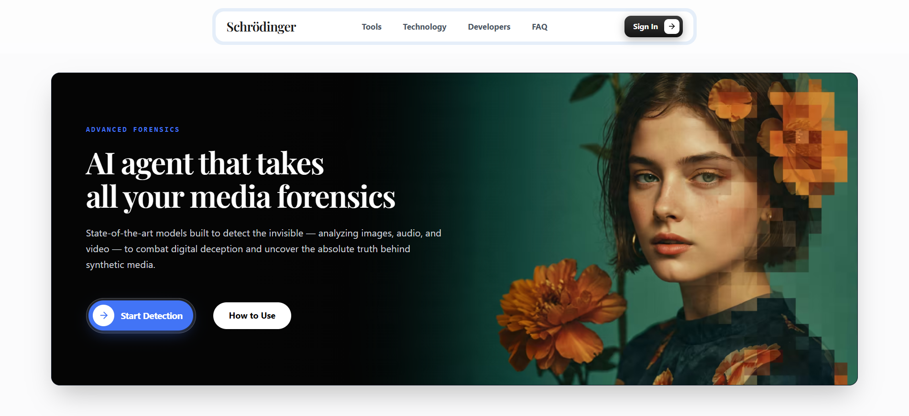
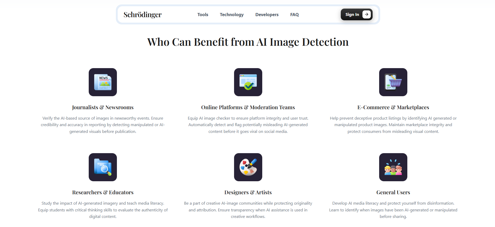
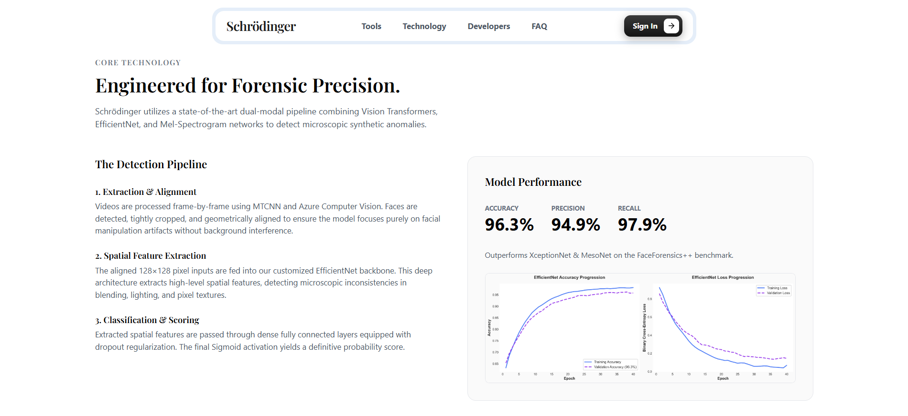
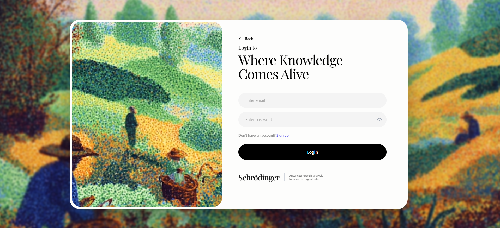
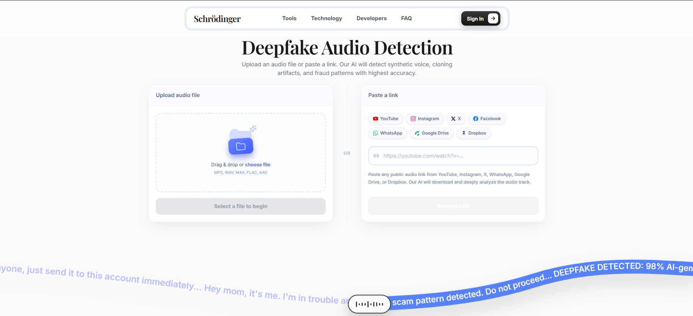
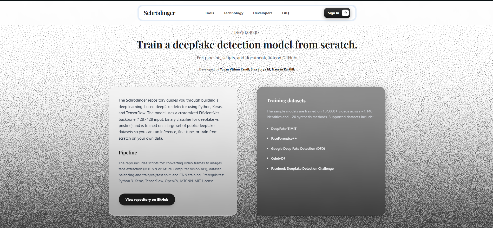
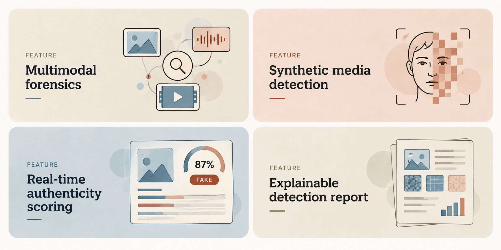
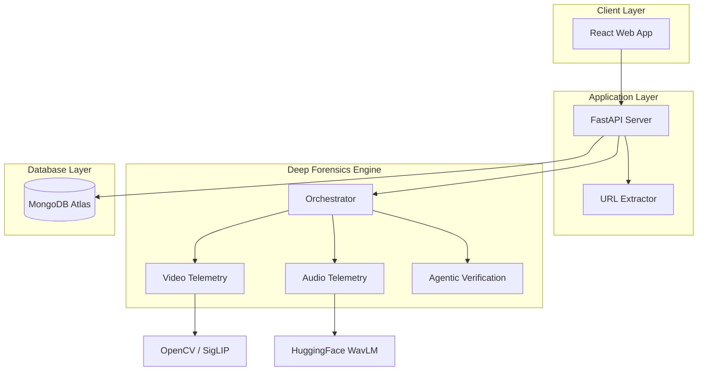
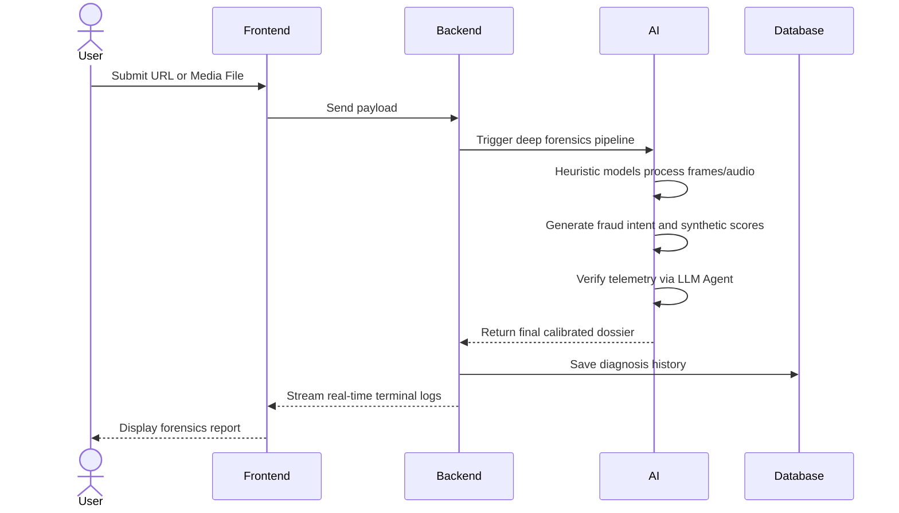

<div align="center">
  
</div>

<br />

<div align="center">
<p>An open-source, AI-powered deepfake forensics platform with multi-layer mathematical heuristics, agentic verification, live URL extraction, and real-time inference telemetry.</p>
<br />

<p align="center">


<a href="https://schrodinger-app.vercel.app/">

</a>
<a href="LICENSE">

</a>


</p>


</div>

---

<div align="center">

<table>
  <tr>
    <td></td>
    <td></td>
  </tr>
  <tr>
    <td></td>
    <td></td>
  </tr>
  <tr>
    <td></td>
    <td></td>
  </tr>
</table>

</div>

---

## What you get

<div align="center">

</div>

<details>
<summary><b>See all features</b></summary>

<table>
<tr>
<td width="50%" valign="top">

#### 🤖 Multi-Layer Heuristic Engine

- **Video Analysis** — Optical Flow tracking, FFT frequency variance, and SigLIP temporal coherence checks.
- **Audio Diagnostics** — WavLM dynamics, MFCC phase analysis, and Griffin-Lim vocoder detection.
- **Image Scanning** — High-frequency GAN grid detection and noise residual profiling.
- **URL Extraction** — Seamlessly bypasses social media protections using yt-dlp to rip and analyze streams directly.

</td>
<td width="50%" valign="top">

#### 🌿 Agentic Verdict Verification

- **Vision LLM Integration** — Mistral Pixtral crosses-examines the generated telemetry.
- **Transcript Analysis** — Fast-Whisper transcribes the audio to screen for coercive financial or urgency vectors (Fraud Risk).
- **Absolute Scoring** — Employs strict mathematically calibrated standards to prevent false positives and bypass smooth diffusion tricks.

</td>
</tr>
<tr>
<td width="50%" valign="top">

#### 💬 Live Forensics Terminal

- **Real-Time Data** — See the backend calculations stream directly to your frontend console.
- **Diagnostic Transparency** — No black boxes. See exactly which layer of the engine flagged the video and why.
- **Dynamic Dossiers** — Download a complete forensic report of the media.

</td>
<td width="50%" valign="top">

#### 🔐 Secure & Modern Platform

- **Cloudflare Tunneled** — Bypasses all local network restrictions for extreme stability.
- **Responsive Design** — Looks stunning on Desktop, Tablet, and Mobile with zero scrollbar cutoffs.
- **Beautiful UI** — Designed with a premium hacker-style terminal aesthetic and micro-animations.

</td>
</tr>
</table>

</details>

<br />

## Get started

```bash
git clone https://github.com/yuvanvishnupandi/schrodinger.git
cd schrodinger
```

Configure your MongoDB database and environment variables, then start the FastAPI backend and Vite frontend (see [Local Setup](#local-setup) below).

<br />

## 🛠️ Tech Stack

<table align="center">
<tr>
<td align="center" width="150">
<a href="https://react.dev">
<br><br>
<b>React</b>
</a>
</td>

<td align="center" width="150">
<a href="https://python.org">
<br><br>
<b>Python</b>
</a>
</td>

<td align="center" width="150">
<a href="https://fastapi.tiangolo.com">
<br><br>
<b>FastAPI</b>
</a>
</td>

<td align="center" width="150">
<a href="https://tensorflow.org">
<br><br>
<b>TensorFlow</b>
</a>
</td>
</tr>

<tr>
<td align="center" width="150">
<a href="https://huggingface.co">
<br><br>
<b>HuggingFace</b>
</a>
</td>

<td align="center" width="150">
<a href="https://opencv.org/">
<br><br>
<b>OpenCV</b>
</a>
</td>

<td align="center" width="150">
<a href="https://mongodb.com">
<br><br>
<b>MongoDB</b>
</a>
</td>

<td align="center" width="150">
<a href="https://tailwindcss.com">
<br><br>
<b>Tailwind CSS</b>
</a>
</td>
</tr>

<tr>
<td align="center" width="150">
<a href="https://vitejs.dev">
<br><br>
<b>Vite</b>
</a>
</td>

<td align="center" width="150">
<a href="https://vercel.com">
<br><br>
<b>Vercel</b>
</a>
</td>

<td align="center" width="150">
<a href="https://cloudflare.com">
<br><br>
<b>Cloudflare</b>
</a>
</td>

<td align="center" width="150">
<a href="https://github.com">
<br><br>
<b>GitHub</b>
</a>
</td>
</tr>
</table>

<br><br>

---

<h2 id="architecture">🏛️ Overall system architecture</h2>

The application follows a modern decoupled architecture consisting of the React presentation layer, FastAPI backend, Deep Learning models, and MongoDB database. Each component operates independently and communicates through REST APIs.



<br />

## Diagnostic processing workflow

The following sequence diagram illustrates how media is processed from submission to full diagnosis.



<br />

## Core data flow

1. User submits a URL or uploads a media file.
2. The React frontend forwards the request to the FastAPI backend.
3. The Orchestrator routes the media to the appropriate Vision/Audio layers.
4. Mathematical heuristics (FFT, Optical Flow, MFCC) generate confidence scores.
5. The processed diagnosis is verified by a Vision LLM to ensure accuracy.
6. The user receives a comprehensive, real-time terminal output and forensic dossier.

<br />

<h2 id="multi-agent-ai-engine">🧠 Deep Forensics Engine</h2>

The AI service is designed as a collection of specialized layers. Each layer performs a dedicated task, allowing the system to process media rapidly and thoroughly.

<details>
<summary><b>See all layers</b></summary>

<br />

- **Video Processing**
  - Measures inter-frame jitter via dense Optical Flow.
  - Generates GAN signatures using Fast Fourier Transforms (FFT).

- **Audio Processing**
  - Uses WavLM and MFCC Phase Analysis to detect AI voice cloning.
  
- **Agentic Verification**
  - Employs Pixtral-12b to cross-examine telemetry and generate a human-readable summary.

- **Fraud Intent Detection**
  - Transcribes audio using Fast-Whisper and runs NLP to search for coercive, scam-like linguistics.

</details>

<br />

<h2 id="local-setup">🚀 Local setup</h2>

### Prerequisites

- Node.js 18 or later
- Python 3.11 or later
- MongoDB Atlas account

### Clone repository

```bash
git clone https://github.com/yuvanvishnupandi/schrodinger.git
cd schrodinger
```

<details>
<summary><b>Backend setup</b></summary>

```bash
cd backend
pip install -r requirements.txt
python -m uvicorn main:app --host 0.0.0.0 --port 8000
```

</details>

<details>
<summary><b>Frontend setup</b></summary>

```bash
cd frontend
npm install
npm run dev
```

</details>

<br />

<h2 id="environment-variables">Environment variables</h2>
<details>
<summary><b>Full reference</b></summary>

<br />

> Template based on the services in use — confirm exact variable names against your `.env.example` files before deploying.

| Variable | Description | Where |
|----------|-------------|-------|
| `MONGODB_URL` | MongoDB connection string | `backend/.env` |
| `GROQ_API_KEY` | Groq API Key | `backend/.env` |
| `MISTRAL_API_KEY` | Mistral API Key | `backend/.env` |
| `GEMINI_API_KEY` | Gemini API Key | `backend/.env` |

</details>

<br />

## Data & storage

- **Database** — MongoDB Atlas
- **Uploads** — Temporary ephemeral processing
- **Hosting** — Frontend on Vercel, Backend via Cloudflare Tunnels

<br />

## License

Schrödinger is [MIT licensed](LICENSE).

<br />

## 📚 Research & References

The core heuristics and deep learning pipelines in Schrödinger are heavily inspired by foundational research in digital media forensics. Our engine implements concepts from the following peer-reviewed papers:

1. **FaceForensics++: Learning to Detect Manipulated Facial Images** *(Rossler et al., 2019)*  
   *Used as the primary structural basis for our EfficientNet-based spatial artifact detector.*
2. **Exposing DeepFake Videos By Detecting Face Warping Artifacts** *(Li & Lyu, 2019)*  
   *Informs our MTCNN geometric alignment and resolution-inconsistency checks.*
3. **Wav2Vec 2.0 / WavLM For Speech Processing** *(Chen et al., 2022)*  
   *Foundation for our audio temporal phase and frequency variance analysis.*
4. **CNN-generated images are surprisingly easy to spot... for now** *(Wang et al., 2020)*  
   *Provides the mathematical baseline for our High-Frequency GAN grid detection.*
